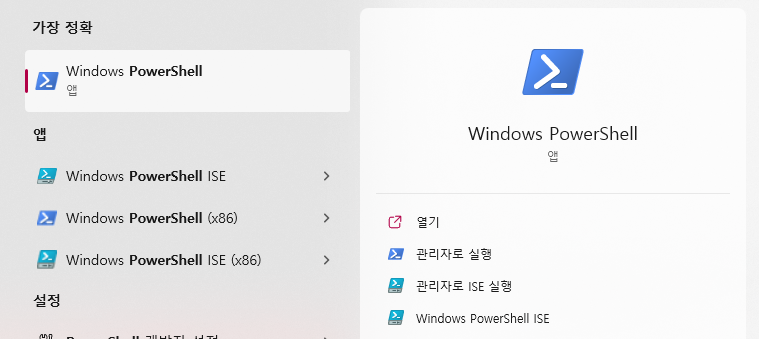

이 포스팅은 보안 오류: (") []. PSSecurityException 오류 해결 방법을 제공한다.

## 문제증상
VScode에서 npm으로 Gatsby 설치 후 버젼을 확인하려고 `gatsby -v` 를 실행하니 아래와 같이 스크립트 실행 불가 에러가 발생하였다. 

## 해결과정
로그에서 말하는 PSSecurityException에 대해 검색해보니 보안 실행 정책 제한되어있기에 발생하는 오류인 것을 확인했다. 즉, 스크립트 실행 권한이 없다는 뜻이다.
스크립트를 실행할 수 있게 허용하려면 PowerShell 실행 정책을 Restricted에서 RemoteSigned 또는 Unrestricted로 설정해야한다.

1. PowerShell을 관리자 모드로 실행한다. 
	- Windows Vista 이상 버전의 Windows에서 로컬 컴퓨터 LocalMachine 범위에 대 한 실행 정책을 변경 하는 명령을 실행 하려면 관리자 권한으로 실행해야한다.

2. 콘솔 창에 `Get-ExecutionPolicy -List`를 입력하면 현재 세션에 영향을 주는 모든 실행 정책을 가져와서 우선 순위로 표시한다. 출력 결과를 보니 현재 실행 정책이 `Restricted`로 제한되어 있음을 알 수 있다. 

3. 스크립트를 실행할 수 있게 허용하려면 실행 정책을 Restricted에서 RemoteSigned 또는 Unrestricted로 설정해야 한다. `Set-ExecutionPolicy RemoteSigned`을 입력해서 현재 실행 정책을 `RemoteSigned`로 변경하자.

4. 변경 상태를 확인하기 위해 `GET-ExecutionPolicy` 명령으로 현재 보안 실행 정책을 확인해보면 정상적으로 변경되어 있는 것을 확인할 수 있다.

이제 다시 VScode로 돌아가서 스크립트를 실행하면 정상적으로 작동되는 것을 확인할 수 있다.

#### 참고 자료
-  https://docs.vmware.com/kr/vRealize-Automation/7.6/com.vmware.vra.iaas.blade.doc/GUID-C86DCF49-F23B-4B9C-9FD5-95524FB74F01.html
- https://learn.microsoft.com/ko-kr/powershell/module/microsoft.powershell.core/about/about_execution_policies?view=powershell-7.3