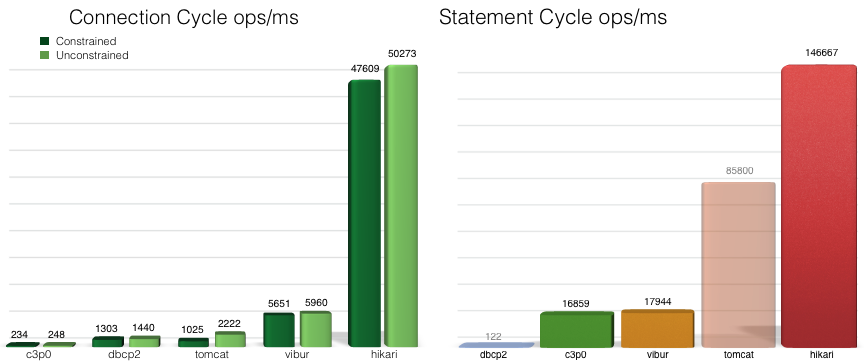
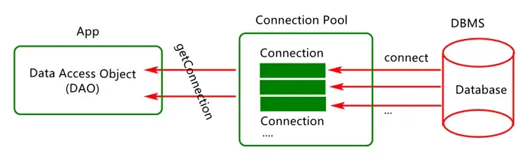
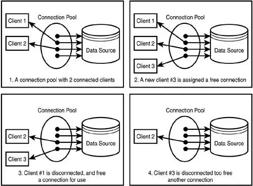
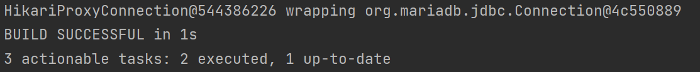

대규모의 사용자가 DB연결을 반복하는 플랫폼을 실행하는 경우에는 Database와 connection을 생성하는 과정 자체가 비용이 많이 들고, 시간이 많이 걸리기 때문에 성능에 영향을 줄 수  있다. 때문에 우리는 성능 향상을 위한 관리가 필요한데 이때 사용할 수 있는 것이 바로 Connection Pool Framework이다.

## JDBC Connection pooling frameworks
기업용으로 사용할 수 있는 여러 Connection Pool Framework가 존재하지만 이것은 어플리케이션에 어떤 프레임워크를 사용해야하는지에 대한 혼란을 만들기도 한다. 어떤 Connection Pool이 서비스에 가장 적합한지 파악하는데 많은 시간을 투자하고 싶지 않다면 가장 추천하는 프레임워크는 HikariCP이다.

C3P0, Apache DBCP, BoneCp, Vibur 등과 같이 선택할 수 있는 프레임워크가 많이 있지만 가장 인기 있는 선택은 **Tomcat JDBC** 및 **HikariCP이다.**



JMH Microbench results : source [HikariCP](https://github.com/brettwooldridge/HikariCP)
위 벤치마크 결과 상으로도 CP 프레임워크 시장에서  HikariCP는 압도적으로 점유하고 있으며, Spring boot 2.0부터는 default JDBC connection pool을 HikariCP로 사용 중이기도 하다. 

## Connection Pool Process



커넥션 풀은 정해진 수량의 connection 객체들을 pool에 담아놓고 getConnection() 요청이 들어오면 Thread가 connection을 요청하여 HikariCP가 pool 내에 있는 connection과 연결해준다. 애플리케이션이 시작될 때마다 커넥션 풀이 데이터베이스와 함께 생성된다.



Connection pool은 connection 객체를 pool 내에서 미리 준비하여 연결을 유지하고 몇 번이고 재사용할 수 있게함으로써 어플리케이션의 성능 저하를 막을 수 있다. 

### Dependency
Spring에서 [HikariCP](https://mvnrepository.com/artifact/com.zaxxer/HikariCP) 사용 시에는 dependencies에 종속성 추가를 해야한다. 
gradle 설정 시 예시는는 아래와 같다.  
```java
// https://mvnrepository.com/artifact/com.zaxxer/HikariCP
implementation group: 'com.zaxxer', name: 'HikariCP', version: '5.0.1'

```

## TestCode
Spring에서 jdbc 드라이버와 HikariCP 종속성을 추가했다면, 올바른 작동 확인을 위한 테스트를 진행한다. 
```java
@Test  
public void testHikariCP() throws Exception { 
//Connection 생성을 위한 HikariCP 테스트  
  
    HikariConfig config = new HikariConfig(); 
    //HikariConfig 타입의 객체를 생성한다.(CP를 생성하는데 필요한 정보를 가지고 있음)  
    config.setDriverClassName("org.mariadb.jdbc.Driver");  
    config.setJdbcUrl("jdbc:mariadb://localhost:3306/testdb");  
    config.setUsername("testUser");  
    config.setPassword("1111");  
    config.addDataSourceProperty("cachePrepStmts", "true");  
    config.addDataSourceProperty("prepStmtCacheSize", "250");  
    config.addDataSourceProperty("prepStmtCacheSqlLimit", "2048");  
  
    HikariDataSource ds = new HikariDataSource(config); 
    //HikariDataSource 객체를 생성해서  
    Connection connection = ds.getConnection(); 
    // getConnection()으로 Connection 객체를 얻어서 사용한다.  
  
    System.out.println(connection);  
  
    connection.close();  
	//JDBC 프로그래밍에서 가장 중요한 것은 Connection은 반드시 close() 해야한다.
}
```

테스트 코드를 실행하면 출력 결과에서 HikariCP를 통해 얻어온 Connection을 확인할 수 있다.



>@ 뒤의 값은 다를 수 있다. 

참고문헌
- https://medium.com/javarevisited/choosing-the-right-jdbc-connection-pool-c9ef90588d55
- https://book.interpark.com/product/BookDisplay.do?_method=detail&sc.prdNo=355020973&gclid=CjwKCAiAwc-dBhA7EiwAxPRylBVoaskxg2RSgHN2w9Hqqi8gA8RiQypg2QoQHG4JsreiQURisLSpoBoCZM8QAvD_BwE